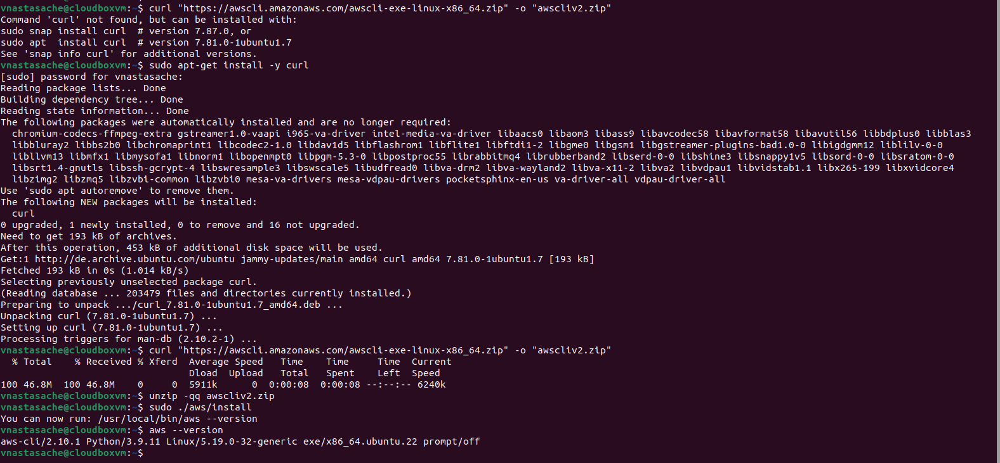
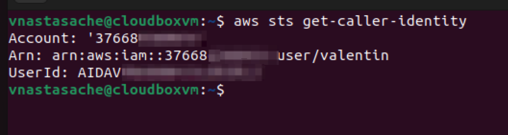

# Week 0 — Billing and Architecture

## Required Homework/Tasks

### Install and Verify AWS CLI

I decided to use a local environment VM, because I had issues with Gitpod or Github Codespaces.
I installed the AWS CLI via command in Ubuntu terminal.

I followed the instructions on this page: [Installing or updating the latest version of the AWS CLI](https://docs.aws.amazon.com/cli/latest/userguide/getting-started-install.html)

Ran these commands on the terminal:
```bash
curl "https://awscli.amazonaws.com/awscli-exe-linux-x86_64.zip" -o "awscliv2.zip"
```
but I got the error that I had no curl installed, So I installed it and tried again, unpacked:
```bash
unzip -qq awscliv2.zip
```

and installed it
```bash
sudo ./aws/install
```
and tested it with
```bash
aws --version
```


I created an IAM user and assigned access key, proof that it's working:



## Homework Challenges

